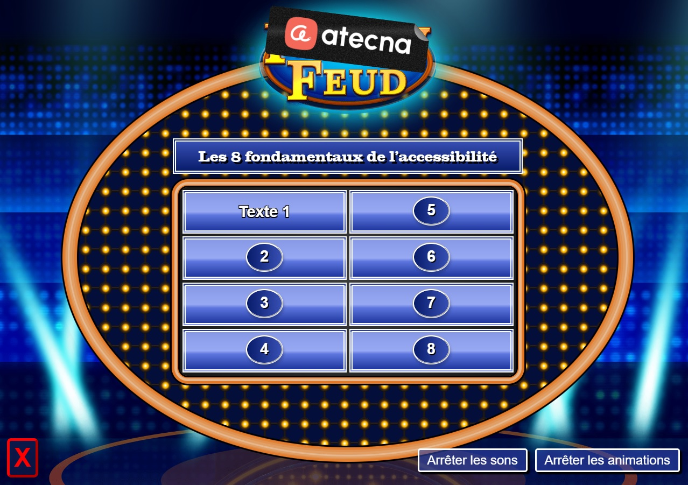

# Accessible Family feud

This repository is an implementation of the family feud game, designed to be used 
by [Atecna](https://www.atecna.fr/) on there accessibility workshop.

THIS REPO CANNOT BE REPLICATED FOR OTHER PURPOSE. See the [licence](./LICENCE.md) for more informations.

## Installation

The index.html file needs to be served by a web server. You can either deploy it to any platform 
without change or, if you use it on your local machine, install the dependencies with:

`npm install`

## Getting started

Once the dependencies installed, just run `npm start` and go on 
[localhost:3000](http://localhost:3000/) on your browser.